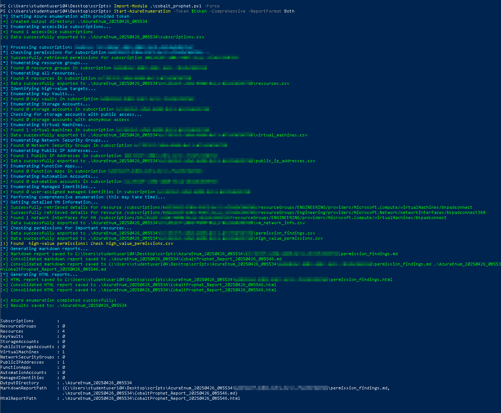

# COBALT PROPHET AZURE ENUMERATION TOOLKIT


The COBALT PROPHET toolkit consists of two complementary PowerShell-based tools for Azure cloud environment enumeration and reconnaissance, designed specifically for red team operations and security assessments.

## Overview

The COBALT PROPHET toolkit enables security professionals to efficiently gather intelligence about Azure environments. Both tools map accessible resources, identify permissions, discover security weaknesses, and generate detailed reports to support informed security assessments, but use different approaches:

- **CobaltProphet.ps1**: Uses direct Azure Management REST API calls with JWT token authentication
- **AzCobaltProphet.ps1**: Leverages official Az PowerShell modules with standard Azure authentication workflows



## Features

### Core Enumeration Capabilities

- **Subscription Discovery**: Identifies accessible Azure subscriptions
- **Resource Mapping**: Enumerates resource groups and resources
- **Identity Analysis**: Discovers managed identities and permission configurations
- **High-Value Target Identification**: Locates key vaults, storage accounts, VMs, and more

### Advanced Security Assessment

- **Permission Testing**: Identifies privilege escalation paths and excessive permissions
- **Security Misconfiguration Detection**: Discovers exposed storage accounts and weak access controls
- **Network Security Analysis**: Maps NSGs and public IP addresses
- **Secret Management Evaluation**: Tests access to storage account keys and connection strings

### Comprehensive Reporting

- **CSV Data Export**: All findings are exported to structured CSV files
- **Interactive HTML Reports**: Generates rich, interactive reports with search and filtering
- **Markdown Reports**: Creates lightweight reports for quick review and sharing
- **Security Findings Summary**: Highlights high-value findings and potential security issues

## Installation

### Prerequisites

- PowerShell 5.1 or higher
- Azure subscription access

For **CobaltProphet.ps1** (REST API approach):
- Optional: MSAL.PS module for token acquisition

For **AzCobaltProphet.ps1** (Az modules approach):
- Az PowerShell modules

### Installation Steps

#### CobaltProphet.ps1 (REST API approach)

```powershell
# Clone the repository
git clone https://github.com/watson0x90/CobaltProphet.git
cd CobaltProphet

# Import the module
Import-Module .\CobaltProphet.ps1
```

#### AzCobaltProphet.ps1 (Az modules approach)

```powershell
# Install Az PowerShell modules if not already installed
Install-Module -Name Az -Scope CurrentUser -Repository PSGallery -Force

# Clone the repository or download the script
git clone https://github.com/yourusername/AzCobaltProphet.git
cd AzCobaltProphet

# Import the module
Import-Module .\AzCobaltProphet.ps1
```

## Usage Comparison

### CobaltProphet.ps1 (REST API approach)

```powershell
# Get a token (requires MSAL.PS module)
$token = Get-AzureToken
Start-AzureEnumeration -Token $token

# Run basic enumeration with token in JWT Format
Start-AzureEnumeration -Token "eyJ0eX..."

# Comprehensive enumeration with HTML report only
Start-AzureEnumeration -Token $token -Comprehensive -ReportFormat "HTML"

# Individual function example
$storageAccounts = Get-AzureStorageAccounts -Token $token -SubscriptionID "your-subscription-id"
```

### AzCobaltProphet.ps1 (Az modules approach)

```powershell
# Authenticate to Azure first
Connect-AzAccount

# Run basic enumeration
Start-AzCPEnumeration

# Comprehensive enumeration with HTML reports only
Start-AzCPEnumeration -Comprehensive -ReportFormat "HTML"

# One-step authentication and enumeration
Start-AzCPAudit -Interactive -Comprehensive

# Individual function example
$storageAccounts = Get-AzCPStorageAccounts -SubscriptionID "your-subscription-id"
```

## Function Reference

### CobaltProphet.ps1 (REST API approach)

| Function | Description |
|----------|-------------|
| `Start-AzureEnumeration` | Main function to perform comprehensive enumeration |
| `Get-AzureSubscriptionID` | Discovers accessible Azure subscriptions |
| `Get-AzureResourceList` | Lists all resources in a subscription |
| `Get-AzureResourceGroups` | Lists all resource groups in a subscription |
| `Get-AzureVirtualMachines` | Enumerates virtual machines |
| `Get-AzureKeyVaults` | Enumerates key vaults |
| `Get-AzureStorageAccounts` | Enumerates storage accounts |
| `Get-AzureStorageAccountsWithAnonymousAccess` | Identifies public storage accounts |
| `Test-AzureResourceActions` | Tests permissions on Azure resources |
| `Get-AzureResourcePermissions` | Gets permissions for a specific resource |
| `Get-AzureNetworkSecurityGroups` | Lists network security groups |
| `Get-AzurePublicIPAddresses` | Lists public IP addresses |
| `New-AzureEnumerationMarkdownReport` | Generates markdown reports |
| `New-AzureEnumerationHtmlReport` | Generates HTML reports |

### AzCobaltProphet.ps1 (Az modules approach)

| Function | Description |
|----------|-------------|
| `Start-AzCPEnumeration` | Main function to perform comprehensive enumeration |
| `Start-AzCPAudit` | Combines authentication and enumeration in one step |
| `Get-AzCPSubscriptionID` | Discovers accessible Azure subscriptions |
| `Get-AzCPResourceList` | Lists all resources in a subscription |
| `Get-AzCPResourceGroups` | Lists all resource groups in a subscription |
| `Get-AzCPVirtualMachines` | Enumerates virtual machines |
| `Get-AzCPKeyVaults` | Enumerates key vaults |
| `Get-AzCPStorageAccounts` | Enumerates storage accounts |
| `Get-AzCPStorageAccountsWithAnonymousAccess` | Identifies public storage accounts |
| `Test-AzCPResourceActions` | Tests permissions on Azure resources |
| `Get-AzCPResourcePermissions` | Gets permissions for a specific resource |
| `Get-AzCPNetworkSecurityGroups` | Lists network security groups |
| `Get-AzCPPublicIPAddresses` | Lists public IP addresses |
| `New-AzCPEnumerationMarkdownReport` | Generates markdown reports |
| `New-AzCPEnumerationHtmlReport` | Generates HTML reports |

## Choosing Between the Tools

### CobaltProphet.ps1 (REST API approach)

**Advantages:**
- Direct API interaction with minimal dependencies
- JWT token-based authentication for scenarios where interactive login isn't possible
- Can be used in environments without Az PowerShell modules
- Potentially lower detection footprint with targeted API calls

**Best for:**
- Red team operations requiring maximum stealth
- Scenarios requiring token-based authentication
- Environments with restricted PowerShell module installation
- Operations from non-Windows environments

### AzCobaltProphet.ps1 (Az modules approach)

**Advantages:**
- Simplified authentication using standard Az PowerShell workflows
- Improved reliability through Microsoft's tested and supported modules
- Better error handling with more detailed information
- No need to manage API versions or REST endpoint details
- Easier to maintain and update

**Best for:**
- Standard security assessments and audits
- Environments with Az PowerShell already installed
- Operations requiring interactive authentication
- Teams more familiar with PowerShell than REST APIs

## Report Examples

The reports generated by both tools provide the same features and format:

### HTML Report

The HTML report provides interactive features:
- Global search functionality
- Table filtering
- Color-coded security findings
- Full-detail views of large datasets
- Mobile-friendly responsive design

### Markdown Report

The markdown report offers:
- Lightweight format viewable in any text editor
- Table of contents for easy navigation
- Summarized findings for quick review
- Links to detailed data reports

## Use Cases

- **Security Assessments**: Evaluate Azure environments for security weaknesses
- **Red Team Operations**: Map attack surfaces and identify privilege escalation paths
- **Penetration Testing**: Discover potential entry points and security misconfigurations
- **Security Compliance**: Audit Azure environments against security best practices
- **Security Posture Evaluation**: Assess the overall security posture of Azure deployments

## Operational Security Considerations

Both tools are designed with operational security in mind:
- Option for lightweight markdown reports to avoid browser activity
- Structured output for easy integration with other tools
- Avoids unnecessary or potentially detectable operations

## Contributing

Contributions are welcome! Please feel free to submit a Pull Request.

1. Fork the repository
2. Create your feature branch (`git checkout -b feature/amazing-feature`)
3. Commit your changes (`git commit -m 'Add some amazing feature'`)
4. Push to the branch (`git push origin feature/amazing-feature`)
5. Open a Pull Request

## License

This project is licensed under the MIT License - see the LICENSE file for details.

## Disclaimer

The COBALT PROPHET toolkit is intended for authorized security testing and assessment only. The authors are not responsible for any misuse or damage caused by these tools. Always ensure you have proper authorization before conducting security assessments.
